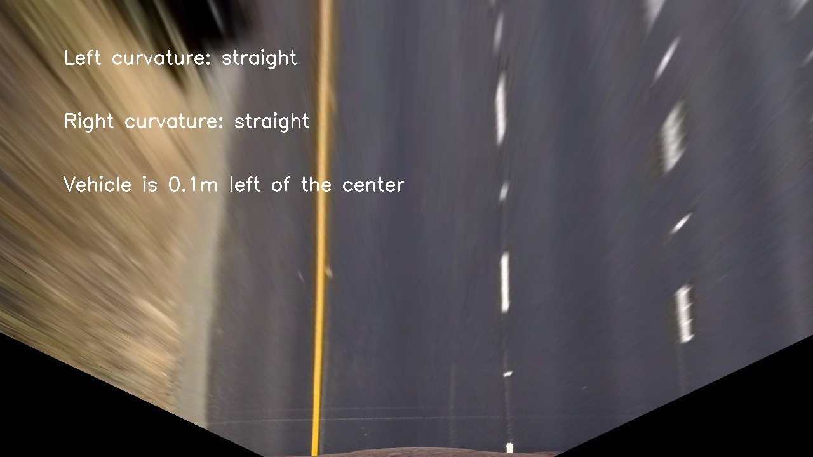
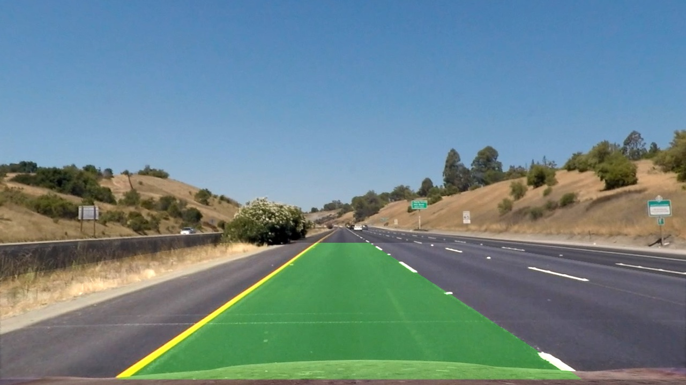

# Advanced Lane Finding Project
## Introduction
This is one document for the project Advanced Lane Finding. 
Main steps of this project are the following:

1. Compute the **camera calibration** matrix and distortion coefficients given a set of chessboard images.
1. Apply a **distortion** correction to raw images.
1. Use color transforms, gradients, etc., to **create a thresholded binary image**.
1. Apply a perspective transform to rectify binary image (**"birds-eye view"**).
1. Detect lane pixels and fit to **find the lane boundary**.
1. Determine the **curvature** of the lane and vehicle position with respect to center.
1. **Warp** the detected lane boundaries back onto the original image.
1. Output **visual display** of the lane boundaries and numerical estimation of lane curvature and vehicle position.
1. Deal with **videos** with the pipeline.

The code can be found in the file *Advanced_Lane_Finding.ipynb* and each steps are explained in the following section.

## Camera calibration
The correct camera matrix and distortion coefficients could be gotten using the OpenCV functions: *cv2.calibrateCamera()*. When we call this function, three important parameters are needed: 
1. **objectPoints:** which is a vector of vectors decided by the chessboard size which is 9x6 in our project. We can get the *objectPoints* for each calibration image by using two funciton: *numpy.zeros()* and *numpy.mgrid()*. 
1. **imagePoints:** which is also a vector of vectors indicating the position of the corners in the chessboard calibration image, we can get it from the calibration image by the function *findChessboardCorners()*.
3. **imageSize:** which is the size of the calibration image, in our project, all the image have the same size. We can get it by the method *image.shape[::-1]*.

After we get all the *objectPoints* and *imagePoints*, we can calculate the **camera matrix** and **distortion coefficients** through the function *cv2.calibrateCamera()*. Then, we can undistort the images token by the same camera. Here is an example of a distortion corrected calibration image:

I have undistorted all the calibration images and saved them in the folder */output_images/undist_camera_cal*.

## Distortion correction
According the **camera matrix** and **distortion coefficients** we got in the last step, we can do the distortion correcting for the test images. For the test image as following:

We can get the undistortion image:

We can go through all images by *for-loop*, so I have undistorted all the test images and saved them in the folder */output_images/undist*.

## Create thresholded binary image
The method of combining color transforms and gradients is implemented in our project to generate the binary image as function *threshold_binary()* and the code can be found in the file *Binary_Img.py*.

1. First, I convert the image to HLS color space and sort the L and S channel from Line 7 to Line 9. 
1. Then the sobel operation is applied to the L channel, as the code from Line 11 to Line 13. 
1. The sobel threshold and the S channel threshold are appied seperated from Line 16 to Line 21. 
1. Finally, sobel binary and channel binary are combined and return, as the code from Line 24 to Line 27.

For the undistortion image:

The result binary image as following:

By go through all the undistortion image, I get binary images for all of them, saved in the folder *output_images/binary*.

## Birds-eye view

In order to implement the perspective transform, get a "birds-eye view"image, two function are implemented in the file *Transform.py*:
1. **transform_matrix():** which return the perspective transform and the inverse perspective transform as shown in the code from Line 4 to Line 18. In this function, two points arrays are defined first as source points and destinaiton points. Then, the function *cv2.getPerspectiveTransform()* is applied to generate the perspective transform and inverse perspective transform.   
1. **transform():** which applies one matrix to image. If the matrix is transform matrix, one birds-eye view image is returned. If the matrix is inverse transform matrix, one undistortion image can be returned.

For one undistortion image:

The result birds-eye view image as following:

By go through all the undistortion image, I get birds-eye view images for all of them, saved in the folder *output_images/birds_eye*.

## Lane boundary

Two funciton are created to find the lane boundary in the file *Finding_Lane.py*:
- **find_lane_pixels():** which return left and right lane line pixel positions. 
    1. One histogram of the bottom half of the image is generated as the first step by the function *np.sum()* in Line 7. 
    1. Then, two peak of the left and right halves of the histogram are found, which will be starting points for left and right lane lines corresponding as shown from Line 12 to Line 14 in code. 
    1. In order to search the lane line points using sliding windows method, some parameters are set, including the number of sliding windows, margin for the width of windows, the minimum pixels for recenter window and the height for each window which is gotten from image size and window number, Line 18 - Line 36. 
    1. One for-loop steps through all windows one by one to find the lane line pixels. Boundaries of two rectangles are calculated firstly, Line 41 - Line 47. Which are also drew to the image (Line 50 - Line 53). Then, nonzero pixels are identified and saved, Line 56 - Line 69. If there are more found pixels then the minimum pixels set in last step, the window center will be re-calculated (Line 72 - Line 75).
    1. Subsequently, arrays of indices of two lane line piexls are concatenated. And pixels positions are extracted for returning (Line 77 - Line 92).

- **fit_polynomial():** which return the x and y values for plotting lane lines, one image where lanes lines and sliding window are indicated. 
    1. Lane pixels are computed first by the function *find_lane_pixels()* (Line 98).
    1. Then, one second order polynomial for each lane line is caluclated (Line 101 and Line 102).
    1. According the second order polynomial, x and y values for plotting are calculated (Line 105 - Line 114), and different colors are set to lane line pixels (Line 118 and Line 119).
    1. The last step is to draw two lane line to image (Line 130 - Line 132).

After we converte one birds-eye image to binary, we can use the two function: *find_lane_pixels()* and *fit_polynomial()* to find the lane line and indicating in the output image. For one birds-eye image as following:

We can get one image as following:

 In the image, two yellow lines indicate the lane, and the left lane pixels are in blue, right lane pixels are in read. Green rectangles indicate the sliding windows.

 By go through all the birds-eye image, I compute lane line for all of them, saved in the folder *output_images/find_lane*.

## Lane curvature and vehicle position

Four functions are implement for calculating and showing the curvature value in the file *Curvature.py* :

- **generate_polynomials():** which returns the real world curvature in meter. The first step is to get the line pixels by function *find_lane_pixels()* (Line 13). Then, the second order polynomial is computed taking into consider the real phyical distance for each pixel (Line 15 and Line 16).

- **measure_curvature_real():** which returns the left and right lane line curvature value in the vehicle positioin and the vehicle position relative to the lane centre. The second order polynomia is calculated by function *generate_polynomials()* (Line 27). Then, the maximum y value is set as the y value of vehicle position (Line 30). And the value of vehicle position relative to lane centre is computed (Line 32 - Line 35). The last step is to compute the curvature as shown from Line 38 to Line 46.

- **write_curvature():** which returns one image with lane curvature and vehicle position information. Some parameters, curvature and vehicle position information are prepared first from Line 69 to Line 82. Then, those information are writen to image (Line 84 - Line 103).

- **display_curvature():** which integrate the previous funciton to compute and show the curvature and vehicle position information to image. Firstly, the binary image is returned by the funciton *threshold_binary()* (Line 57). Then, the curvature and vehicle position information is calculated by *measure_curvature_real()* (Line 58). The last step is to show the information in image and return them (Line 60).

For one birds-eye image:

We can calculate and show the curvature and vehicle position information as following:

 By go through all the birds-eye image, the curvature and vehicle position information are computed and writen to images saved in the folder *output_images/curvature*.

## Warp back lane boundaries

Two function has been implemented in file *Warp.py* to warp lane back onto the original image:
- **warp_lane():** which returns one warped image which has same space with origina image and contains lane area with green color. The first step is to get the binary image of the birds-eye image (Line 16). Secondly, those points of left and right lane line are computed (Line 18 - Line 21). Thirdly, the green color is filled into the lane area (Line 24). Finally, birds-eye image are warped back in function *warpPerspective()* (Line 27).

- **show_warp_lane():** which return the undistortion image with lane area in green. This is finished by the function *addWeighted()* through combining the undistortion image and re-warped image returned by *warp_lane()*.

For one undistortion image:

The result re-warped image as following:

By go through all the undistortion image, the lane is warped onto the original image space and saved in the folder *output_images/warp_lane*.

## Visual display

In order to visual display the lane area and show the curvature, vehicle position information, one function is created: 

- **visual_lane():** which return one image show the imformation: lane are in green, curvature and vehicle positon. The fisrt step is to warp back lane boundaries like last section (Line 2 - Line 6). Then, calculate and write the curvature and positon information to image (Line 9 - Line12). This funciton is also one pipeline to deal with the image. 

For one undistortion image:

The result re-warped image as following:

By go through all the undistortion image, all visual display image are generated and saved in the folder *output_images/visual_lane*.

## Videos

According the function implemented previously, the function *process_img()* is created to deal with each frame of video. The image is undistorted first (Line 7), the the funciton *visual_lane()* deal with it to generate one image including lane area, curvature and vehicle position information.

With this function, the three videos are processed and saved in the folder *test_videos_output*.

## Discussion 

1. Some of function should be re-organized, such as the two section warp back lane boundaries and visual display, some of code has repeated. In the visual display part, the processing of binary image is involved in two different step. Which means if I want to adapt the thresholded parameters, I need change them in two place at the same time.

1. For the challange and hard challange video, I cannot find the lane successfully. Some parameters could be adjusted, eg. thresholded for binary image, area for get histogram.